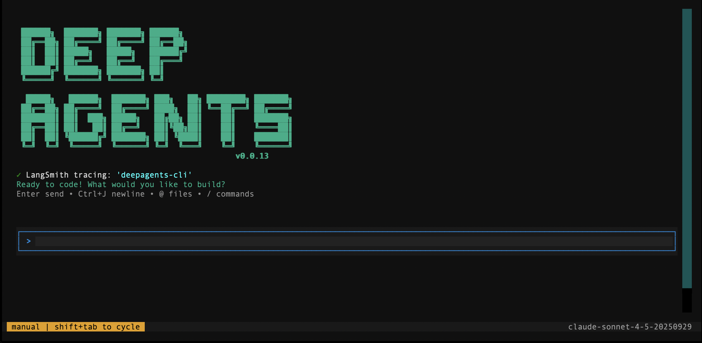

<p align="center">
  
</p>

<h1 align="center">Deep Agents CLI</h1>

<p align="center">
  The Deep Agents harness in your terminal.
</p>

## Quickstart

```bash
uv tool install deepagents-cli
deepagents
```

This gives you a fully-featured coding agent with file operations, shell commands, web search, planning, and sub-agent delegation in your terminal.

## Usage

```bash
# Use a specific model
deepagents --model claude-sonnet-4-5-20250929
deepagents --model gpt-4o

# Auto-approve tool usage (skip confirmation prompts)
deepagents --auto-approve

# Execute code in a remote sandbox
deepagents --sandbox modal
```

## Model Configuration

The CLI auto-detects your provider based on available API keys:

| Priority | API Key | Default Model |
|----------|---------|---------------|
| 1st | `OPENAI_API_KEY` | `gpt-5.2` |
| 2nd | `ANTHROPIC_API_KEY` | `claude-sonnet-4-5-20250929` |
| 3rd | `GOOGLE_API_KEY` | `gemini-3-pro-preview` |

## Customization

The CLI supports persistent memory, project-specific configurations, and custom skills. See the [documentation](https://docs.langchain.com/oss/python/deepagents/cli) for details on:

- **AGENTS.md** — Persistent memory for preferences and coding style
- **Skills** — Reusable workflows and domain knowledge
- **Project configs** — Per-project settings in `.deepagents/`

## Resources

- **[Documentation](https://docs.langchain.com/oss/python/deepagents/cli)** — Full CLI reference
- **[Deep Agents](https://github.com/langchain-ai/deepagents)** — The underlying agent harness
